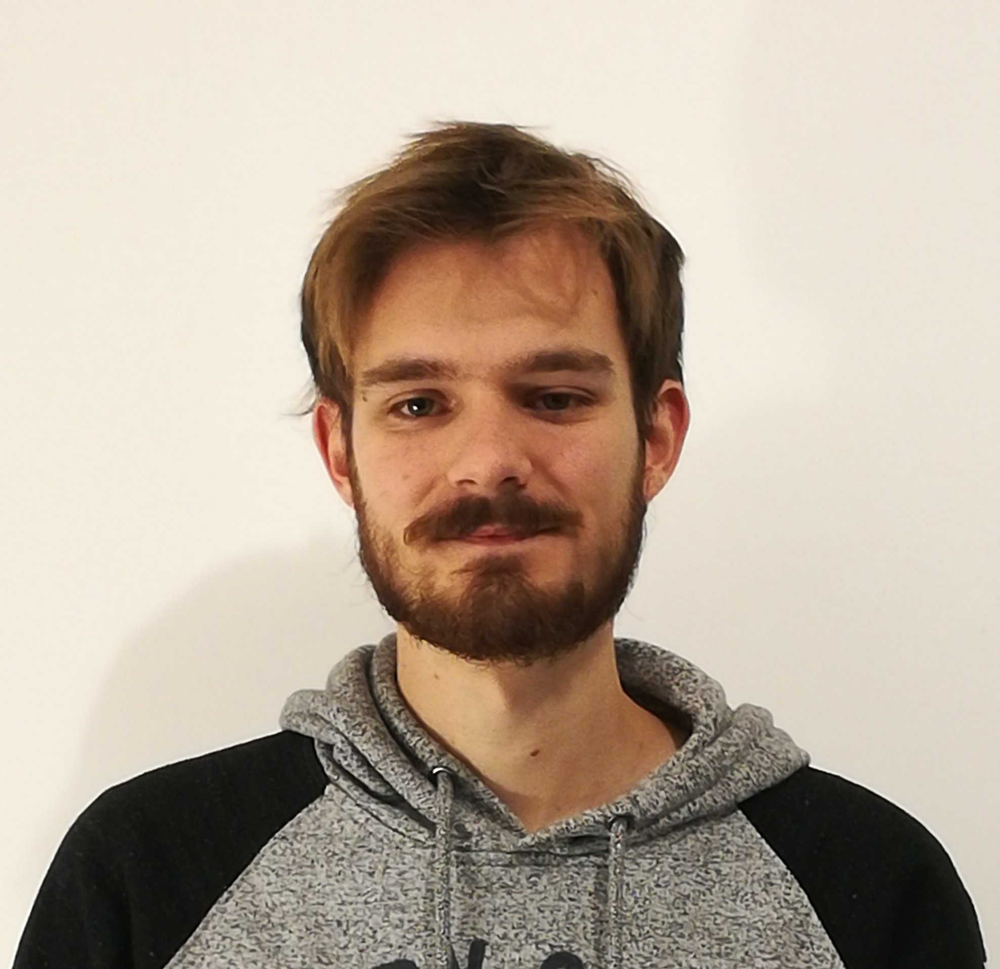

<a href ="https://univ-cotedazur.fr"> Université Côte d'Azur </a>  
 <a href ="https://univ-cotedazur.fr/laboratoires/laboratoire-jean-alexandre-dieudonne-ljad"> Laboratoire Jean Alexandre Dieudonné </a>  
    

 
 

I am a postdoctoral researcher at Université Côte d'Azur under the supervision of [François Delarue](https://math.univ-cotedazur.fr/~delarue/). 

My research lies in the area of mean field control and mean field game analysis,
with particular emphasis on their numerical aspects, models incorporating risk
aversion, and environmental applications.
My work repeatedly relies on tools from convex optimization, mathematical analysis, and stochastic control in order to study both the theoretical properties of the
considered models and the design of efficient computational methods.

Mathematical fields of interests: mean field control, mean field games, numerical methods, optimization, probability.
